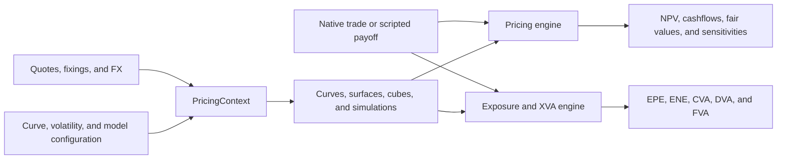

# QuantSupport

QuantSupport is a quantitative-finance library written in Rust, with Python bindings provided in the same repository. It combines instrument construction, market-data bootstrapping, pricing, automatic differentiation, payoff scripting, Monte Carlo exposure simulation, and XVA in one toolkit.

A crate is available for usage in your project:

```rust
cargo add quantsupport
```

## Quick start: price and risk a swap

This complete example values a five-year receive-fixed USD swap against a flat SOFR curve and asks for NPV, par rate, cashflows, and curve sensitivity.

```rust
use std::{cell::RefCell, rc::Rc};

use quantsupport::prelude::*;

fn main() -> Result<()> {
    let valuation_date = Date::new(2024, 1, 15);
    let maturity_date = Date::new(2029, 1, 15);
    let notional = 10_000_000.0;

    let swap = MakeSwap::<DualFwd>::default()
        .with_identifier("USD_IRS_5Y".to_string())
        .with_start_date(valuation_date)
        .with_maturity_date(maturity_date)
        .with_fixed_rate(0.03)
        .with_notional(notional)
        .with_rate_definition(RateDefinition::new(
            DayCounter::Actual360,
            Compounding::Simple,
            Frequency::Semiannual,
        ))
        .with_currency(Currency::USD)
        .with_market_index(MarketIndex::SOFR)
        .with_side(Side::LongReceive)
        .with_fixed_leg_frequency(Frequency::Semiannual)
        .with_floating_leg_frequency(Frequency::Semiannual)
        .build()?;
    let trade = SwapTrade::new(swap, valuation_date, notional, Side::LongReceive);

    let curve = FlatForwardTermStructure::new(
        valuation_date,
        DualFwd::from(0.03),
        RateDefinition::new(
            DayCounter::Actual360,
            Compounding::Continuous,
            Frequency::Annual,
        ),
    )
    .with_pillar_label("SOFR_flat".to_string());

    let mut elements = ConstructedElementStore::default();
    elements.discount_curves_mut().insert(
        MarketIndex::SOFR,
        DiscountCurveElement::new(MarketIndex::SOFR, Rc::new(RefCell::new(curve))),
    );

    let context = PricingContext::new()
        .with_quote_store(QuoteStore::new(valuation_date))
        .with_fixing_store(FixingStore::default())
        .with_base_currency(Currency::USD)
        .with_constructed_elements(elements);

    let pricer = DiscountedCashflowPricer::<Swap<DualFwd>, SwapTrade<DualFwd>>::new();
    let requests = [
        Request::Value,
        Request::FairRate,
        Request::Cashflows,
        Request::Sensitivities,
    ];
    let results = pricer.evaluate(&trade, &requests, &context)?;

    println!("NPV: {:.2}", results.price().unwrap_or_default());
    println!(
        "Par rate: {:.6}",
        results.fair_rate().unwrap_or_default()
    );

    if let Some(risk) = results.sensitivities() {
        for (pillar, exposure) in risk.instrument_keys().iter().zip(risk.exposure()) {
            println!("dPV/dQuote {pillar}: {exposure:.4}");
        }
    }

    if let Some(cashflows) = results.cashflows() {
        println!("Cashflows: {}", cashflows.payment_dates().len());
    }

    Ok(())
}
```

The same program, with a more detailed cashflow report, is available in [`examples/valuation`](examples/valuation).

## Architecture and components

QuantSupport separates market observables, calibrated market objects, product
definitions, and valuation engines. This keeps the same market construction and
risk machinery reusable across deterministic pricing, Monte Carlo, scripting,
and XVA.



### Market inputs and conventions

`QuoteStore`, `FixingStore`, and `FxStore` contain observable data: instrument
quotes, historical index fixings, and spot FX rates. Dates, calendars, schedules,
day-count rules, compounding, currencies, and indices provide the conventions
used to interpret those observations and build product cashflows.

Scenarios also operate at this input layer. A shocked valuation rebuilds the
dependent market rather than modifying an already-built curve, so curves,
volatility objects, and simulations remain consistent with one another.

### Market construction

`PricingContext` is the boundary between raw inputs and objects that can be used
for valuation. It combines the stores with serializable configuration and builds
the dependency graph in order:

1. discount and forwarding curves, including multi-curve and collateralized FX
   dependencies;
2. credit curves bootstrapped from CDS quotes;
3. volatility surfaces and cubes;
4. calibrated model configurations and Monte Carlo simulations.

The resulting `ConstructedElementStore` is shared by all downstream engines.
Pricers request only the curves, fixings, FX rates, volatility objects, or paths
needed by a particular trade. See the [architecture](book/src/concepts/architecture.md)
and [pricing context](book/src/concepts/pricing-context.md) chapters for the
detailed object model.

For example, a production context can be assembled from JSON-backed stores and
configuration, then initialized once before pricing a portfolio:

```rust,ignore
let mut context = PricingContext::new()
    .with_quote_store(quotes)
    .with_fixing_store(fixings)
    .with_fx_store(fx)
    .with_base_currency(Currency::USD)
    .with_base_index(MarketIndex::SOFR)
    .with_curve_configurations(curve_configs)
    .with_volatility_surface_configurations(surface_configs)
    .with_simulation_configurations(simulation_configs);

context.initialize()?;
```

Attaching a scenario uses the same construction path. Here every quote whose
identifier contains the `SOFR` segment is shifted up by one basis point before
the dependent market is rebuilt:

```rust,ignore
let mut shocked_context = PricingContext::new()
    .with_quote_store(quotes)
    .with_fixing_store(fixings)
    .with_curve_configurations(curve_configs)
    .with_scenarios(vec![Scenario::new(
        "SOFR",
        0.0001,
        ScenarioType::Absolute,
    )]);

shocked_context.initialize()?;
```

See [`examples/bootstrap`](examples/bootstrap) for configuration loading and
multi-curve construction, and [`examples/sensitivity`](examples/sensitivity)
for quote-level risk across dependent curves.

### Products: native instruments and scripts

There are two ways to represent a product:

- **Native instruments** model standard products such as bonds, swaps, caps,
  swaptions, equity and FX options, cross-currency swaps, futures, and CDSs.
  An instrument defines the economics and cashflows; a trade adds ownership
  information such as notional, side, and trade date.
- **Scripted products** describe bespoke payoffs as dated events that observe
  rates, discount factors, FX, or equity spots and emit payments. Scripts use
  the same market models and automatic-differentiation tape as native products,
  so they produce NPV, expected cashflows, and quote-level sensitivities without
  requiring a new Rust instrument or pricer.

Native products are the preferred path when a standard cashflow or closed-form
model exists. Scripting is intended for structured coupons, digitals, range
accruals, autocallables, and products whose terms change more quickly than the
library API. The [scripting guide](book/src/scripting/overview.md) documents the
language and runtime.

A scripted product is a dated financial event stream. For example, the following event observes SOFR for one
accrual period and adds the discounted coupon to the `note` variable, which would represent the value of the product:

```rust,ignore
let events = vec![CodedEvent::new(
    Date::new(2026, 1, 2),
    r#"
        accrual = cvg("2026-01-02", "2026-04-02", "Actual360");
        coupon = RateIndex("SOFR", "2026-01-02", "2026-04-02");
        note pays 1000000 * coupon * accrual on "2026-04-02" in "USD";
    "#
    .to_string(),
)];

let stream = EventStream::try_from(events)?;
let engine = ScriptEngine::new(
    stream,
    reference_date,
    Currency::USD,
    MarketIndex::SOFR,
)?;
let (values, cashflows) =
    engine.evaluate_with_cashflows(&mut market_model, Some("note"))?;
```

Interoperability between engines is possible under QuantSupport. In this example, the same `EventStream` can be wrapped in `ScriptedProduct` and converted to
contingent claims for XVA. [`examples/scripting`](examples/scripting) compares
this path with a native swap for NPV, pillar sensitivities, and exposure.

### Pricing and risk

Pricers combine a trade with the market objects supplied by `PricingContext`.
Cashflow products use generic discounting, while options and optional rates
products can use Black, Hull-White, LGM, or Monte Carlo engines. Every call to a pricer
returns an `EvaluationResults` object containing the outputs requested by the
caller, such as NPV, fair rate, cashflows, or sensitivities.

Automatic differentiation runs through market construction and valuation.
Quotes become labelled leaves on the AAD tape, so a reverse sweep maps a result back
to the curve or volatility quotes that produced it. This is the common risk
mechanism for native pricers, scripted payoffs, and XVA. Full revaluation under
quote scenarios complements AAD for stress tests and non-linear moves.

### Exposure and XVA

Trades and scripted products can both be converted into contingent claims. A contigent claim in QuantSupport represents a single cashflow inside a product. The exposure engine evaluates those claims across simulated paths and aggregates them by netting set and CSA. The same workflow produces NPV cubes and exposure
profiles, then CVA, DVA, and FVA with sensitivities to the original market
quotes.

## Installation

Add the latest Rust crate release:

```bash
cargo add quantsupport
```

To work from this checkout instead:

```toml
[dependencies]
quantsupport = { path = "../quantsupport" }
```

The main Rust workflows are re-exported through the prelude:

```rust
use quantsupport::prelude::*;
```

Build and test the library with:

```bash
cargo build -p quantsupport
cargo test -p quantsupport
```

## Runnable Rust examples

All examples below are workspace packages and use local JSON market data where appropriate.

| Example | Demonstrates | Run |
| --- | --- | --- |
| [`valuation`](examples/valuation) | Flat-curve swap NPV, cashflows, and AAD sensitivity | `cargo run -p valuation` |
| [`bootstrap`](examples/bootstrap) | JSON quote loading and dependent USD/CLP multi-curve bootstrapping | `cargo run -p bootstrap` |
| [`sensitivity`](examples/sensitivity) | Multi-curve pricing of SOFR, Term SOFR, ICP, and cross-currency swaps with pillar DV01 | `cargo run -p sensitivity` |
| [`volatilitysurface`](examples/volatilitysurface) | Building and querying an interpolated SOFR caplet Black-volatility surface | `cargo run -p volatilitysurface` |
| [`hullwhite`](examples/hullwhite) | Curve construction, caplet-vol calibration, Hull-White pricing, simulation, and plots | `cargo run -p hullwhite` |
| [`pfe`](examples/pfe) | Multi-currency LGM exposure simulation for swaps, FX products, and cross-currency swaps | `cargo run -p pfe` |
| [`cva`](examples/cva) | High-level netting-set XVA with CSA, credit/funding inputs, CVA/FVA values, exposure profiles, and AAD sensitivities | `cargo run -p cva` |
| [`scripting`](examples/scripting) | Scripted swap vs native swap: NPV and pillar sensitivities through `ScriptEngine` | `cargo run -p scripting-examples --bin valuation` |
| [`scripting`](examples/scripting) | Scripted product as XVA contingent claims: EPE and CVA/FVA sensitivities vs native swap | `cargo run -p scripting-examples --bin xva` |

The `plot` Cargo feature enables the library's plotting helpers:

```bash
cargo add quantsupport --features plot
```

## Python bindings

The Python are under development, but a package exposes typed dates and enums, market-data/configuration objects, curve/volatility/simulation exploration, the supported trade specifications, pricing results as pandas tables, quote scenarios, and the high-level XVA workflow.

Build it into the active virtual environment from the repository root:

```bash
python -m pip install maturin
maturin develop -m bindings/python/Cargo.toml --release
```

Minimal usage:

```python
import quantsupport as qs

quotes = qs.QuoteStore.from_json("quotes.json")
curves = qs.CurveConfiguration.from_json("curve_specs.json")
discounting = qs.DiscountingConfig(
    currency=qs.Currency.USD,
    index=qs.MarketIndex.SOFR,
)

with qs.PricingContext(
    quotes=quotes,
    curves=curves,
    discounting=discounting,
) as context:
    sofr = context.curve(qs.MarketIndex.SOFR)
    print(sofr.nodes())
    print(sofr.discount_factor(quotes.reference_date + "5Y"))
```

See the [Python README](bindings/python/README.md) and [guided notebook](bindings/python/examples/tour.ipynb) for pricing and XVA examples.

## Book

The [QuantSupport Book](https://jmelo11.github.io/quantsupport/) covers installation, market construction, pricing, risk, scripting, simulation, and XVA. It is published to GitHub Pages on every push to `main`; the sources live under [`book/src`](book/src/SUMMARY.md). To build it locally, install [mdBook](https://rust-lang.github.io/mdBook/), then from the repository root:

```bash
mdbook build
mdbook serve --open
```

Generated HTML is written to `book/html/`.

## Contributing

Contributions are welcome. For small fixes, feel free to open a pull request directly. For larger changes or design discussions, please open an issue first.

## License

QuantSupport is released under the [MIT License](LICENSE).

## Contact

For business inquiries, contact <jmelo@live.cl>.
