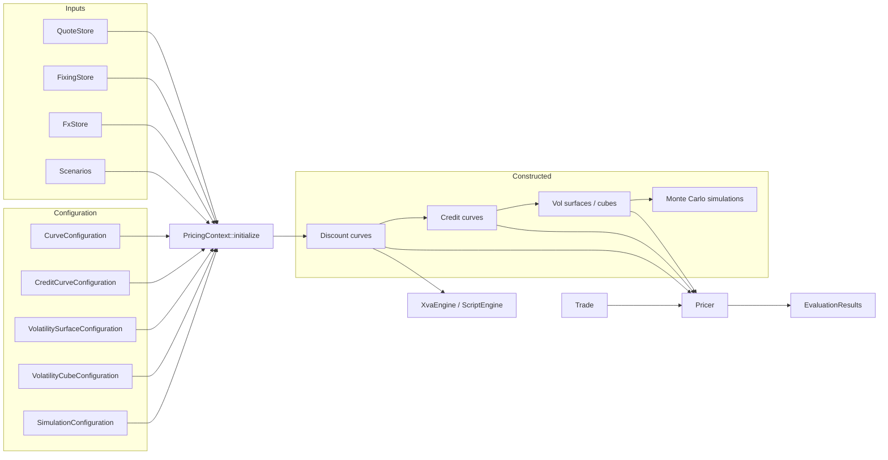

# Architecture

QuantSupport separates **observable inputs**, **constructed market objects**, **instruments and trades**, and **pricers**. This chapter explains why the layers exist and how data flows between them.

## Layer 1 – observable inputs

`QuoteStore`, `FixingStore` and `FxStore` hold what the market actually publishes: par swap rates, deposit rates, basis spreads, caplet and swaption volatilities, FX forwards, CDS spreads, past index fixings and spot FX. Quotes are strings-plus-numbers; nothing has been interpolated or bootstrapped yet. Scenarios (`Scenario`) act on this layer only, which is what makes shocked valuations consistent: every downstream object is rebuilt from the shocked quotes.

## Layer 2 – configuration

Configuration structs say *how* to turn quotes into objects: which quotes belong to the SOFR curve, which interpolator to use, which caplet quotes form the vol surface, what model drives a simulation. They are plain `Serialize`/`Deserialize` data, so the same JSON can drive Rust and Python. See [Configuration](../reference/configuration.md) for schemas.

## Layer 3 – constructed elements

`PricingContext::initialize()` produces the `ConstructedElementStore`, a set of `HashMap<MarketIndex, *Element>`:

| Accessor | Element | Holds |
| --- | --- | --- |
| `discount_curves()` / `discount_curve(&idx)` | `DiscountCurveElement` | `Rc<RefCell<dyn InterestRatesTermStructure<DualFwd>>>` |
| `dividend_curves()` / `dividend_curve(&idx)` | `DividendCurveElement` | dividend yield curve for equity indices |
| `credit_curves()` / `credit_curve(&idx)` | `CreditCurveElement` | survival-probability curve from CDS |
| `volatility_surfaces()` / `volatility_surface(&idx)` | `VolatilitySurfaceElement` | expiry × key surface |
| `fx_volatility_surface(&FxPair)` | `OrientedFxVolSurface` | surface oriented for a pair, inverting if only the reciprocal pair exists |
| `volatility_cubes()` / `volatility_cube(&idx)` | `VolatilityCubeElement` | expiry × tenor × key cube |
| `simulations()` | `MonteCarloSimulationElement` | generated paths |

Each accessor has a `_mut` twin so bootstrappers and hand-built markets can insert objects. The order of construction inside `initialize()` is fixed: scenarios → discount curves (`MultiCurveBootstrapper`) → credit curves (`CreditCurveBootstrapper`, which discounts CDS legs on the curves just built) → volatility surfaces → volatility cubes → simulations (`SimulationBuilder`, which may calibrate models to the surfaces/cubes).

## Layer 4 – instruments and trades

An **instrument** (`Swap`, `CapFloor`, `FxForward`, …) describes cashflows: legs, coupons, indices, dates, strikes. It is built with a `Make*` builder and knows nothing about who owns it. A **trade** (`SwapTrade`, `FxForwardTrade`, …) adds `trade_date`, `notional` and `Side`. Pricers and the XVA engine consume trades; `IntoContingentClaims` is implemented on trades.

Instruments implement `Discountable` (asset class, currency, optional own discount index) so `DiscountPolicy` objects can decide which curve discounts them.

## Layer 5 – pricers and results

A `Pricer` maps `(trade, requests, market) → EvaluationResults`. Before pricing, `market_data_request(trade)` declares the curves, fixings, FX rates and vol objects the pricer needs; the `PricingContext` (as `MarketDataProvider`) resolves them through `handle_request`, returning a `MarketData` bundle. This indirection is what allows the same pricer to run against a full context, a hand-built store, or a shocked copy.

`Evaluator` offers dynamic dispatch by trade `TypeId` when a portfolio mixes instrument types.

## Layer 6 – simulation, scripting and XVA

`LgmMarketModel` and `HullWhite` read the constructed curves (and calibrate to constructed vol objects); `ScriptEngine` evaluates payoffs on a `MarketModel<DualFwd>`; `XvaEngine` decomposes trades into `ContingentClaim`s and prices them on the simulated paths. Because these layers consume the same `DiscountCurveElement`s that the deterministic pricers use, NPV at \(t_0\) from the exposure engine equals the pricer NPV, and AAD sensitivities flow back to the same quote pillars.

## The AD thread running through everything

All constructed elements are built in `DualFwd`. Quote values become tape leaves during bootstrapping; discount factors, forwards and vols are tape nodes derived from them. Any result computed from the market—an NPV, a CVA, a scripted payoff—can be back-propagated to those leaves. The [Automatic Differentiation](../risk/aad.md) chapter explains the tape API; the practical consequence is that `Request::Sensitivities` costs roughly one extra evaluation regardless of the number of quotes.
