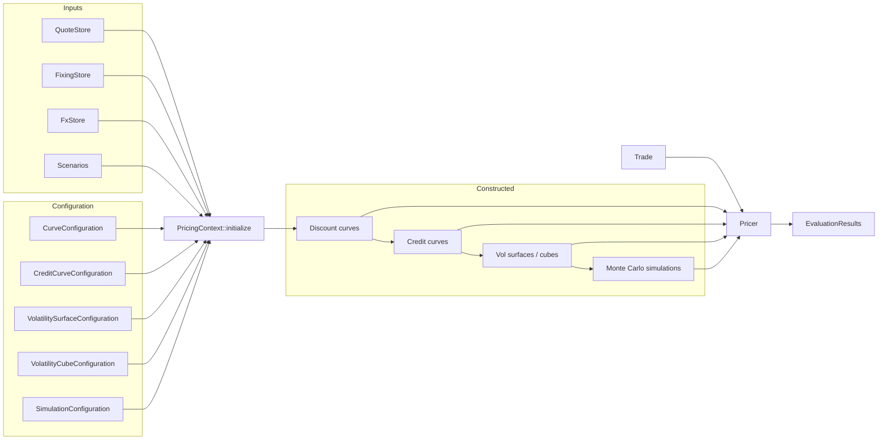

# Architecture

QuantSupport separates **observable inputs**, **constructed market objects**, **instruments and trades**, and **pricers**. This chapter explains why the layers exist and how data flows between them.

The separation matters because valuation systems combine data with very
different lifecycles. Quotes can change every day, contract terms remain fixed,
and a pricing method can be replaced without redefining either one. The
following diagram gives the complete path before each layer is developed in
turn.



Each arrow points from an input to the component that consumes it. A context
constructs market objects from observations and configuration. A pricer
receives a trade and requests the market objects required by its methodology.

## Layer 1 – observable inputs

`QuoteStore`, `FixingStore` and `FxStore` hold what the market actually publishes: par swap rates, deposit rates, basis spreads, caplet and swaption volatilities, FX forwards, CDS spreads, past index fixings and spot FX. At this stage, quotes remain observed strings and numbers. Scenarios (`Scenario`) act on this layer, and every downstream object is rebuilt from the transformed quotes.

## Layer 2 – configuration

Configuration structs say _how_ to turn quotes into objects: which quotes belong to the SOFR curve, which interpolator to use, which caplet quotes form the vol surface, what model drives a simulation. They are plain `Serialize`/`Deserialize` data, so the same JSON can drive Rust and Python. See [Configuration](../reference/configuration.md) for schemas.

## Layer 3 – constructed elements

`PricingContext::initialize()` produces the `ConstructedElementStore`, a set of `HashMap<MarketIndex, *Element>`:

| Accessor                                             | Element                       | Holds                                                                     |
| ---------------------------------------------------- | ----------------------------- | ------------------------------------------------------------------------- |
| `discount_curves()` / `discount_curve(&idx)`         | `DiscountCurveElement`        | `Rc<RefCell<dyn InterestRatesTermStructure<DualFwd>>>`                    |
| `dividend_curves()` / `dividend_curve(&idx)`         | `DividendCurveElement`        | dividend yield curve for equity indices                                   |
| `credit_curves()` / `credit_curve(&idx)`             | `CreditCurveElement`          | survival-probability curve from CDS                                       |
| `volatility_surfaces()` / `volatility_surface(&idx)` | `VolatilitySurfaceElement`    | expiry × key surface                                                      |
| `fx_volatility_surface(&FxPair)`                     | `OrientedFxVolSurface`        | surface oriented for a pair, inverting if only the reciprocal pair exists |
| `volatility_cubes()` / `volatility_cube(&idx)`       | `VolatilityCubeElement`       | expiry × tenor × key cube                                                 |
| `simulations()`                                      | `MonteCarloSimulationElement` | generated paths                                                           |

Each accessor has a `_mut` twin so bootstrappers and hand-built markets can insert objects. The order of construction inside `initialize()` is fixed: scenarios → discount curves (`MultiCurveBootstrapper`) → credit curves (`CreditCurveBootstrapper`, which discounts CDS legs on the curves just built) → volatility surfaces → volatility cubes → simulations (`SimulationBuilder`, which may calibrate models to the surfaces/cubes).

## Layer 4 – instruments and trades

An **instrument** (`Swap`, `CapFloor`, `FxForward`, …) describes cashflows: legs, coupons, indices, dates, and strikes. A `Make*` builder creates it from contractual terms. A **trade** (`SwapTrade`, `FxForwardTrade`, …) adds `trade_date`, `notional`, and `Side`. Pricers and the XVA engine consume trades. Trade types implement `IntoContingentClaims` for simulation workflows.

Instruments implement `Discountable` (asset class, currency, optional own discount index) so `DiscountPolicy` objects can decide which curve discounts them.

## Layer 5 – pricers and results

A `Pricer` maps `(trade, requests, market) → EvaluationResults`. Before pricing, `market_data_request(trade)` declares the required curves, fixings, FX rates, and volatility objects. The `PricingContext`, acting as `MarketDataProvider`, resolves them through `handle_request` and returns a `MarketData` bundle. This indirection allows the same pricer to run against a full context, a hand-built store, or a shocked copy.

`Evaluator` offers dynamic dispatch by trade `TypeId` when a portfolio mixes instrument types.

## Layer 6 – simulation, scripting and XVA

The final layer reuses the deterministic market in path-dependent workflows.
Simulation models consume calibrated curves and volatility markets. Scripting
turns path observations into cashflows, and XVA aggregates those cashflows by
counterparty and collateral agreement.

### Market representations and dynamics models

A volatility market represents observable option prices across expiry, tenor,
and strike. A dynamics model describes how risk factors evolve through time.
The calibration step connects these two layers:

```text
quotes -> volatility market -> model calibration -> resolved parameters -> simulation
             grid or SABR       HW, LGM, HJM, LMM
```

A SABR-backed surface fits naturally in the constructed-market layer. It can
implement the existing `VolatilitySurface` or `VolatilityCube` query contract,
which allows Hull-White, HJM, LMM, and other dynamics models to use it as a
calibration target. A constructed volatility object carries two records with
distinct purposes. Calibration instrument identifiers describe the option
contracts available to a calibration basket, including their expiries,
tenors, and strikes. AD risk pillars identify the differentiable values
registered on the tape and named in sensitivity results. A SABR
implementation can retain its source option identifiers for downstream model
calibration. Its fitted `alpha`, `beta`, `rho`, and `nu` parameters can serve
as the AD risk pillars.

SABR path generation is a separate use case. In that role, SABR becomes a
dynamics-model variant with a SABR parameter type and a SABR calibrator.

`ParameterSource<P, C>` gives configurable dynamics models a shared way to
describe fixed parameters and calibration targets. Hull-White and one-factor
LGM use `GaussianRateModelParameters { sigma }`. An HJM variant can define
factor loading functions and correlations. An LMM variant can define a
forward-volatility matrix. Each calibrator reads constructed curves and
volatility markets, then produces the parameter type required by its model.

`LgmMarketModel` and `HullWhite` read constructed curves and volatility
markets. `ScriptEngine` evaluates payoffs on a `MarketModel<DualFwd>`.
`XvaEngine` decomposes trades into `ContingentClaim`s and prices them on the
simulated paths. These layers share the same `DiscountCurveElement`s used by
deterministic pricers. As a result, exposure-engine NPV at \\(t_0\\) matches
pricer NPV and AAD sensitivities flow back to the same quote pillars.

## The AD thread running through everything

All constructed elements are built in `DualFwd`. Quote values become tape leaves during bootstrapping. Discount factors, forwards, and volatilities become tape nodes derived from them. Any result computed from the market, including NPV, CVA, and scripted payoffs, can be propagated back to those leaves. The [Automatic Differentiation](../risk/aad.md) chapter explains the tape API. In practice, `Request::Sensitivities` costs roughly one extra evaluation regardless of the number of quotes.

## How the layers work together

The architecture creates one direction of dependency. Observations and
configuration build the market, instruments and trades describe obligations,
and valuation components consume both. Automatic differentiation follows the
same direction in the forward calculation and traces it backward for risk.

This structure explains why the same curve can support a deterministic price,
a scenario valuation, a simulation model, and an XVA calculation. Every
workflow shares the market definition and adds the behavior required by its
own layer.
