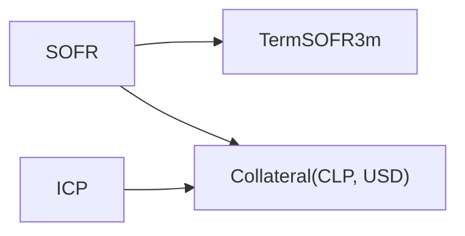

# Multi-Curve Framework

Since the move to OIS discounting, a single currency needs several curves—one to discount collateralised cashflows and one per projected index—and each foreign currency collateralised in the base currency needs a cross-currency-adjusted curve. QuantSupport encodes this with `MarketIndex` naming, discount policies and bootstrapper dependency resolution.

## Curve roles

| Role                      | `MarketIndex`                  | Built from                                                    | Used for                                                              |
| ------------------------- | ------------------------------ | ------------------------------------------------------------- | --------------------------------------------------------------------- |
| CSA / discount curve      | e.g. `SOFR`                    | deposits + OIS                                                | discounting all collateralised USD cashflows; projecting SOFR coupons |
| Projection curve          | e.g. `TermSOFR3m`, `EURIBOR6m` | deposit + basis swaps vs the OIS index (or fixed–float swaps) | forward rates for coupons fixing on that index                        |
| Collateral-adjusted curve | `Collateral(CLP, USD)`         | FX forwards + cross-currency swaps                            | discounting CLP cashflows under a USD CSA                             |
| Local OIS curve           | e.g. `ICP`                     | CLP deposits + OIS                                            | projecting ICP coupons                                                |

Nothing in the code is hard-wired to these names: `PricingContext::with_base_index` / `with_base_currency` (defaults `SOFR` / `USD`) decide which curve is the CSA curve.

## Discount policies

```rust,ignore
pub trait Discountable {
    fn asset_class(&self) -> AssetClass;
    fn discount_index(&self) -> Option<MarketIndex> { None }
    fn currency(&self) -> Currency;
}

pub trait DiscountPolicy: Send + Sync {
    fn accept(&self, target: &dyn Discountable) -> Result<MarketIndex>;
    fn discount_indices(&self) -> Vec<MarketIndex>;
}
```

`Leg`, instruments and trades implement `Discountable`. Two policies ship with the library:

- **`SingleCurveCSADiscountPolicy::new(discount_index, currency)`** – returns `discount_index` when the target's currency equals the CSA currency, and `MarketIndex::Collateral(target_ccy, csa_ccy)` otherwise. This is the derivative (`AssetClass::InterestRate`, `Fx`) rule.
- **`FixedIncomeDiscountPolicy::new(prefer_instrument_index).with_risk_free_index(ccy, idx)`** – for `AssetClass::FixedIncome` only. If `prefer_instrument_index` and the instrument declares its own `discount_index` (issuer curve), that wins; otherwise the per-currency risk-free index; otherwise `InvalidValueErr("No risk-free index configured for currency …")`. Any other asset class is an error.

`BootstrapDiscountPolicy::new(csa_index, csa_currency)` combines both for the bootstrapper: `discount_index(&Leg<f64>)` dispatches on the leg's asset class (`FixedIncome` → fixed-income policy with `prefer_instrument_index = true`; `InterestRate`/`Fx` → CSA policy), and `discount_index_for_currency(ccy)` resolves a bare currency, honouring per-currency collateral overrides first.

`DiscountedCashflowPricer::set_discount_policy(Box<dyn DiscountPolicy>)` installs the same kind of policy at pricing time. Without a policy the pricer falls back to a heuristic: a leg with floating coupons is discounted on the _unique_ curve whose rate index is in the leg currency (an error if there are zero or several), otherwise the leg's `discount_index`, otherwise its `forward_index`. Always set a policy in multi-curve setups.

## Dependency resolution

`CurveConfiguration::dependencies(&policy)` inspects each pillar instrument's legs: the forward index of floating legs and the discount index returned by the policy. `dependency_order` performs a Kahn topological sort. For the standard example configuration:



- `TermSOFR3m` pillars are basis swaps vs SOFR: the SOFR leg is projected _and_ discounted on the solved SOFR curve, and only the TermSOFR3m projection is unknown.
- `Collateral(CLP, USD)` pillars are `FixFloatCrossCurrencySwap_CLP_SOFR_USD_*` (fixed CLP vs float SOFR USD) and `FxForwardPoints_USDCLP_*`. The USD leg is discounted and projected on SOFR; the CLP leg's _discount_ curve is the unknown, so the solve produces the CLP-under-USD-collateral curve directly. FX spot (`FxStore`) converts the two notionals.
- `ICP` is independent; it projects ICP coupons in CLP swaps priced under USD collateral (discounting on the Collateral curve).

Missing pieces are reported explicitly: bootstrapping `TermSOFR3m` without a `SOFR` configuration fails with "Curve TermSOFR3m requires SOFR for discounting but no curve configuration was provided for it".

## Cross-curve sensitivities

Because the IFT step records \\(\partial P^{\text{child}}/\partial P^{\text{parent}}\\) for every parent (`CrossCurveDep`), risk flows through the dependency graph: a CLP swap discounted on `Collateral(CLP, USD)` reports sensitivities to the cross-currency swap quotes, the FX forward points _and_ the SOFR OIS quotes. See [Sensitivities](../risk/sensitivities.md) for the output format.

## Pricing a cross-currency portfolio

```rust,ignore
let mut ctx = PricingContext::new()
    .with_quote_store(quotes)
    .with_fx_store(fx)                          // USD/CLP spot
    .with_base_currency(Currency::USD)
    .with_base_index(MarketIndex::SOFR)
    .with_curve_configurations(vec![sofr, term_sofr_3m, collateral_clp_usd, icp]);
ctx.initialize()?;

// CLP fixed vs ICP swap: projection on ICP, discounting on Collateral(CLP, USD)
let clp_swap = MakeSwap::<f64>::new()
    .with_currency(Currency::CLP)
    .with_market_index(MarketIndex::ICP)
    .with_notional(1_000_000_000.0)
    .with_fixed_rate(0.055)
    .with_start_date(rd)
    .with_maturity_date(rd + Period::from_str("5Y")?)
    .build()?;
let trade = SwapTrade::new(clp_swap, rd, 1_000_000_000.0, Side::LongReceive);

let mut pricer = DiscountedCashflowPricer::<Swap<f64>, SwapTrade<f64>>::new();
pricer.set_discount_policy(Box::new(SingleCurveCSADiscountPolicy::new(MarketIndex::SOFR, Currency::USD)));
let res = pricer.evaluate(&trade, &[Request::Value, Request::Sensitivities], &ctx)?;
```

When the policy resolves a `Collateral(leg_ccy, coll_ccy)` curve, each cashflow is converted at spot and discounted on that curve, \\(PV = CF*{\text{leg}}\times S*{\text{leg}\to\text{coll}}\times P\_{\text{Collateral}}(T)\\), so the `Value` of a CLP swap under a USD CSA is reported in **USD**. Legs in the CSA currency are discounted on the CSA curve without conversion.

## Configuration checklist

1. One `CurveConfiguration` per index that any instrument projects or discounts on.
2. The CSA curve (`base_index`) configured with deposits/OIS in the `base_currency`.
3. For every foreign currency with collateralised trades, a `Collateral(ccy, base_ccy)` configuration with FX forward and/or cross-currency swap pillars, plus the FX spot in the `FxStore`.
4. Fixings for every projected index with coupons already fixed.
