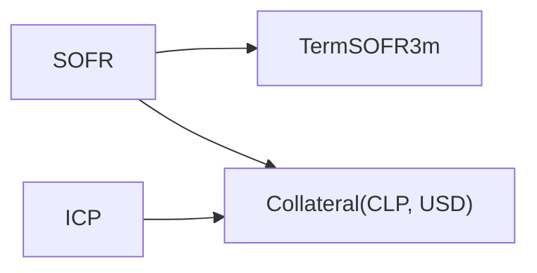

# Multi-Curve Framework

A modern rates portfolio usually needs several related curves. Collateralized cashflows use an overnight discount curve, each floating index has its own projection curve, and foreign-currency cashflows may require a curve adjusted for the collateral currency. This chapter explains how QuantSupport assigns those roles, chooses discount curves, orders calibration dependencies, and carries risk through the resulting graph.

The framework combines three ideas. `MarketIndex` gives every curve a stable identity. Discount policies express the economic rules that map cashflows to curves. The bootstrapper derives a dependency order from the instruments used to calibrate each curve.

## Curve roles

Each curve identity states the market quantity represented by that term structure. The common roles are summarized below, using the USD and CLP example developed throughout the book:

| Role                      | `MarketIndex`                  | Built from                                                    | Used for                                                              |
| ------------------------- | ------------------------------ | ------------------------------------------------------------- | --------------------------------------------------------------------- |
| CSA / discount curve      | e.g. `SOFR`                    | deposits + OIS                                                | discounting collateralized USD cashflows and projecting SOFR coupons  |
| Projection curve          | e.g. `TermSOFR3m`, `EURIBOR6m` | deposit + basis swaps vs the OIS index (or fixed–float swaps) | forward rates for coupons fixing on that index                        |
| Collateral-adjusted curve | `Collateral(CLP, USD)`         | FX forwards + cross-currency swaps                            | discounting CLP cashflows under a USD CSA                             |
| Local OIS curve           | e.g. `ICP`                     | CLP deposits + OIS                                            | projecting ICP coupons                                                |

The names in the table illustrate one market setup. `PricingContext::with_base_index` and `with_base_currency` select the CSA index and currency for an application. Their defaults are SOFR and USD. Changing those settings applies the same framework to another collateral agreement or market.

## Discount policies

A curve name identifies a term structure. A discount policy decides which term structure applies to a particular cashflow or instrument. That decision depends on properties such as asset class, currency, and an optional issuer or instrument index. The two traits below separate the description of a discountable object from the rule that selects its curve:

```rust,ignore
pub trait Discountable {
    fn asset_class(&self) -> AssetClass;
    fn discount_index(&self) -> Option<MarketIndex> { None }
    fn currency(&self) -> Currency;
}

pub trait DiscountPolicy: Send + Sync {
    fn accept(&self, target: &dyn Discountable) -> Result<MarketIndex>;
    fn discount_indices(&self) -> Vec<MarketIndex>;
}
```

`Leg`, instrument, and trade types implement `Discountable`. The library supplies two principal policies:

- **`SingleCurveCSADiscountPolicy::new(discount_index, currency)`** – returns `discount_index` when the target's currency equals the CSA currency, and `MarketIndex::Collateral(target_ccy, csa_ccy)` otherwise. This is the derivative (`AssetClass::InterestRate`, `Fx`) rule.
- **`FixedIncomeDiscountPolicy::new(prefer_instrument_index).with_risk_free_index(ccy, idx)`** applies to `AssetClass::FixedIncome`. When configured to prefer the instrument index, it selects a declared issuer curve first. It then tries the per-currency risk-free index. An absent mapping produces `InvalidValueErr("No risk-free index configured for currency …")`, and another asset class produces a type-specific error.

`BootstrapDiscountPolicy::new(csa_index, csa_currency)` combines these rules during calibration. Its `discount_index` method sends fixed-income legs to the fixed-income policy with instrument-index preference enabled. Interest-rate and FX legs use the CSA policy. `discount_index_for_currency` handles requests that carry only a currency and gives configured collateral overrides priority.

`DiscountedCashflowPricer::set_discount_policy` installs the same kind of rule at valuation time. If the caller omits it, the pricer attempts to infer a curve from the leg. A floating leg requires one unique rate index in its currency. Other legs use a declared discount index and then a forward index. Ambiguity becomes an error. Production multi-curve contexts should therefore set an explicit policy so the collateral agreement remains visible and reviewable.

## Dependency resolution

Curve calibration can begin only after every required parent curve is available. `CurveConfiguration::dependencies` inspects each pillar instrument's legs and collects their forward indices together with the discount indices returned by the policy. `dependency_order` applies a topological sort to that graph. The standard example has the following shape:



- `TermSOFR3m` pillars are basis swaps vs SOFR: the SOFR leg is projected _and_ discounted on the solved SOFR curve, and only the TermSOFR3m projection is unknown.
- `Collateral(CLP, USD)` pillars are `FixFloatCrossCurrencySwap_CLP_SOFR_USD_*` and `FxForward_USDCLP_*_AnchorForwardPoints`. The USD leg is discounted and projected on SOFR. The solve determines the CLP discount curve under USD collateral, and `FxStore` converts the notionals at spot.
- `ICP` is independent. It projects ICP coupons in CLP swaps whose discounting uses the collateral curve.

The arrows mean that the source curve must be solved before the destination curve. SOFR is therefore available when Term SOFR and the collateralized CLP curve are calibrated. ICP can be solved independently and used later for CLP coupon projection.

Missing dependencies are reported with both curve identities. For example, a Term SOFR configuration with no SOFR configuration reports that Term SOFR requires SOFR for discounting. A cycle is also rejected because no valid first calibration exists.

## Cross-curve sensitivities

The calibration graph also defines the path followed by risk. For every parent curve, the implicit-function step records \\(\partial P^{\text{child}}/\partial P^{\text{parent}}\\) in a `CrossCurveDep`. A CLP swap discounted on `Collateral(CLP, USD)` can therefore report sensitivity to cross-currency swap quotes, FX forward points, and the SOFR OIS quotes that influence its parent curve. [Sensitivities](../risk/sensitivities.md) describes the final report format.

## Pricing a cross-currency portfolio

Once the context has built the required curves, trade pricing uses the same index identities and discount policy. The following example initializes a four-curve USD/CLP market and values a CLP fixed-versus-ICP swap under a USD collateral agreement:

```rust,ignore
let mut ctx = PricingContext::new()
    .with_quote_store(quotes)
    .with_fx_store(fx)                          // USD/CLP spot
    .with_base_currency(Currency::USD)
    .with_base_index(MarketIndex::SOFR)
    .with_curve_configurations(vec![sofr, term_sofr_3m, collateral_clp_usd, icp]);
ctx.initialize()?;

// CLP fixed vs ICP swap: projection on ICP, discounting on Collateral(CLP, USD)
let clp_swap = MakeSwap::<f64>::new()
    .with_currency(Currency::CLP)
    .with_market_index(MarketIndex::ICP)
    .with_notional(1_000_000_000.0)
    .with_fixed_rate(0.055)
    .with_start_date(rd)
    .with_maturity_date(rd + Period::from_str("5Y")?)
    .build()?;
let trade = SwapTrade::new(clp_swap, rd, 1_000_000_000.0, Side::LongReceive);

let mut pricer = DiscountedCashflowPricer::<Swap<f64>, SwapTrade<f64>>::new();
pricer.set_discount_policy(Box::new(SingleCurveCSADiscountPolicy::new(MarketIndex::SOFR, Currency::USD)));
let res = pricer.evaluate(&trade, &[Request::Value, Request::Sensitivities], &ctx)?;
```

When the policy selects `Collateral(leg_ccy, coll_ccy)`, each cashflow is converted at spot and discounted on that collateral-adjusted curve:

\\[
PV = CF_{\text{leg}}\,S_{\text{leg}\rightarrow\text{coll}}\,P_{\text{Collateral}}(T).
\\]

The value of a CLP swap under a USD CSA is therefore reported in USD. Cashflows already denominated in the CSA currency use the CSA curve directly and require no FX conversion.

## Configuration checklist

A valid setup follows from the dependency and discounting rules developed above. Before initialization, verify the following items:

1. One `CurveConfiguration` per index that any instrument projects or discounts on.
2. The CSA curve (`base_index`) configured with deposits/OIS in the `base_currency`.
3. For every foreign currency with collateralised trades, a `Collateral(ccy, base_ccy)` configuration with FX forward and/or cross-currency swap pillars, plus the FX spot in the `FxStore`.
4. Fixings for every projected index with coupons already fixed.

## What to remember

The multi-curve framework makes curve choice an explicit part of the market model. Stable index identities describe available term structures, policies encode discounting economics, and calibration dependencies establish construction order. The same graph then carries sensitivities back through parent curves to observable quotes.

With this structure in place, adding a projection index or collateralized currency means supplying its configuration, policy mapping, and market inputs. Existing pricers continue to query curves through the common interfaces introduced in [Curves Overview](overview.md).
