# XVA Overview

`XvaEngine` (`src/xva/engine.rs`) turns a `PricingContext` plus a set of `NettingSet`s into exposure cubes, CVA/FVA values and AD sensitivities in one run.

## Pipeline

```mermaid
flowchart LR
    T[Trades] -->|IntoContingentClaims| C[ContingentClaims]
    C --> N[NettingSet + CsaTerms]
    N --> E[XvaEngine::run]
    E --> P[FixingPreprocessor]
    P --> S[LgmMarketModel paths]
    S --> Q[NpvCube per trade]
    Q --> A[CVA / FVA aggregators]
    A --> R[ExposureResult]
```



`run` performs, in order:

1. Preprocess claims (`FixingPreprocessor` fills realized fixings) and collect the `SimulationRequest`s each claim needs.
2. Validate that every discount index selected by a netting set's discount policy has an `LgmModelConfig`.
3. Build the evaluation grid with `MakeSchedule::new(reference_date, max_payment_date).with_frequency(frequency)`.
4. Compute system discount factors \\(P(0,t_k)\\) from the domestic curve; XVA values are reported in present value on that curve (deterministic, no rate sensitivity through this term).
5. For each netting set build a CVA aggregator (`CreditCurveCvaFactory` if `credit_index` is set, else flat `CvaFactory` from `credit_spread`/`recovery`) and an FVA aggregator (`FundingCurveFvaFactory` from `funding_index` or `funding_spread_curve`, else flat `FvaFactory` from `funding_spread`).
6. Build the LGM market model from the configs (calibrating sigma schedules if `volatility` is `Calibrated`), simulate, evaluate claims into `NpvCube`s, aggregate, and back-propagate adjoints to the labelled leaves.

## Configuration

```rust,ignore
pub struct XvaEngineConfig {
    model_configs: Vec<LgmModelConfig>,   // one per simulated curve
    fx_configs: Vec<FxModelConfig>,       // one per foreign currency
    n_paths: usize,
    seed: u64,
    frequency: Frequency,
}
pub struct LgmModelConfig { market_index, lambda: Option<f64>, sigma: Option<f64>,
                            volatility: Option<VolatilitySourceConfiguration>, driver: Option<MarketIndex> }
pub struct FxModelConfig  { foreign_currency: Currency, fx_vol: f64, rho: f64 }
```

`examples/cva/data/xva_config.json`:

```json
{
  "model_configs": [
    {
      "market_index": "SOFR",
      "lambda": 0.05,
      "volatility": {
        "Calibrated": {
          "source": { "Surface": { "market_index": "SOFR" } },
          "quote_ids": [
            "CapletFloorlet_USD_SOFR_3M_1Y_Absolute_0.045_Straddle_Black"
          ],
          "strike": "Atm",
          "alpha": 0.05
        }
      }
    },
    {
      "market_index": "ICP",
      "lambda": 0.05,
      "volatility": {
        "Calibrated": {
          "source": { "Cube": { "market_index": "ICP" } },
          "quote_ids": ["Swaption_CLP_ICP_1Y_2Y_Absolute_0.045_Black"],
          "alpha": 0.05
        }
      }
    }
  ],
  "fx_configs": [{ "foreign_currency": "CLP", "fx_vol": 0.12, "rho": 0.0 }],
  "n_paths": 2000,
  "seed": 42,
  "frequency": "Monthly"
}
```

## Running

```rust,ignore
let config: XvaEngineConfig = serde_json::from_str(&fs::read_to_string("data/xva_config.json")?)?;
let mut engine = XvaEngine::new(&ctx, config)?;

let csa: CsaTerms = serde_json::from_str(&fs::read_to_string("data/csa_terms.json")?)?;
let mut sets = HashMap::new();
sets.insert("CLIENT_A".to_string(),
            NettingSet::with_csa_terms(vec![swap.into_claims()?, xccy.into_claims()?].concat(), csa));

let result = engine.run(&mut sets)?;
for cube in &result.cubes { println!("{} EPE(1Y) = {:.0}", cube.trade_id, cube.epe()[12]); }
for v in result.xva_values.unwrap_or_default() { println!("{} {} {:.2}", v.netting_set, v.measure, v.value); }
for (label, dv) in result.sensitivities.unwrap_or_default() { println!("{label:40} {dv:12.4}"); }
```

`ExposureResult { cubes: Vec<NpvCube>, xva_values: Option<Vec<XvaValue { netting_set, measure, value }>>, sensitivities: Option<Vec<(String, f64)>> }`. `measure` is `"CVA"` or `"FVA"` (a `DvaAggregator` exists for own-credit calculations built manually).

`cargo run -p cva` runs this on a 5Y USD SOFR swap (10M, receive 3.78%) and a 5Y USD/CLP float-float cross-currency swap and prints netting set, measure and value.

Chapters: [Netting Sets and CSA](netting-csa.md), [CVA, DVA and FVA](cva-dva-fva.md), [XVA Sensitivities](sensitivities.md).
