# XVA Overview

XVA combines pathwise portfolio exposure with counterparty credit, own credit, funding, and collateral terms. `XvaEngine`, implemented in `src/xva/engine.rs`, coordinates that calculation from a `PricingContext` and a collection of `NettingSet` values. One run produces exposure cubes, configured valuation adjustments, and automatic-differentiation sensitivities.

This chapter presents the complete pipeline, its model configuration, and the runtime API. The following chapters develop netting, CSA terms, measure formulas, and sensitivity interpretation.

## Pipeline

```mermaid
flowchart LR
    T[Trades] -->|IntoContingentClaims| C[ContingentClaims]
    C --> N[NettingSet + CsaTerms]
    N --> E[XvaEngine::run]
    E --> P[FixingPreprocessor]
    P --> S[LgmMarketModel paths]
    S --> Q[NpvCube per trade]
    Q --> A[CVA / FVA aggregators]
    A --> R[ExposureResult]
```

The engine first translates trades into claim-level payment logic, then simulates the market observations needed by those claims. Aggregators operate on the resulting netted exposure profiles. The full flow is:



Each arrow passes a more resolved representation to the next stage. Trades become scheduled claims, claims become pathwise NPVs, and NPVs become exposure measures and valuation adjustments.

`run` performs six coordinated stages:

1. Preprocess claims (`FixingPreprocessor` fills realized fixings) and collect the `SimulationRequest`s each claim needs.
2. Validate that every discount index selected by a netting set's discount policy has an `LgmModelConfig`.
3. Build the evaluation grid with `MakeSchedule::new(reference_date, max_payment_date).with_frequency(frequency)`.
4. Compute system discount factors \\(P(0,t_k)\\) from the domestic curve. XVA values are reported in present value on that curve, and this system-discount sequence is held fixed during differentiation.
5. For each netting set build a CVA aggregator (`CreditCurveCvaFactory` if `credit_index` is set, else flat `CvaFactory` from `credit_spread`/`recovery`) and an FVA aggregator (`FundingCurveFvaFactory` from `funding_index` or `funding_spread_curve`, else flat `FvaFactory` from `funding_spread`).
6. Build the LGM market model from the configs (calibrating sigma schedules if `parameter_source` is `Calibrated`), simulate, evaluate claims into `NpvCube`s, aggregate, and back-propagate adjoints to the labeled leaves.

The sequence uses one model path set for all claims in the run. Shared paths make netting coherent across trades and give values and gradients the same random sample.

## Configuration

`XvaEngineConfig` defines the simulated curve factors, FX factors, path count, random seed, and exposure frequency. Each `LgmModelConfig` either owns model parameters or refers to a driver factor, and each `FxModelConfig` adds one foreign currency:

```rust,ignore
pub struct XvaEngineConfig {
    model_configs: Vec<LgmModelConfig>,   // one per simulated curve
    fx_configs: Vec<FxModelConfig>,       // one per foreign currency
    n_paths: usize,
    seed: u64,
    frequency: Frequency,
}
pub struct LgmModelConfig { market_index, lambda: Option<f64>,
                            parameter_source: Option<GaussianRateParameterSource>,
                            driver: Option<MarketIndex> }
pub struct FxModelConfig  { foreign_currency: Currency, fx_vol: f64, rho: f64 }
```

The CVA example supplies the same structure in JSON. It calibrates SOFR from a caplet surface, calibrates ICP from selected swaption-cube instruments, and adds a CLP FX factor:

```json
{
  "model_configs": [
    {
      "market_index": "SOFR",
      "lambda": 0.05,
      "parameter_source": {
        "Calibrated": {
          "source": { "Surface": { "market_index": "SOFR" } },
          "calibration_basket": { "strike": "Atm" }
        }
      }
    },
    {
      "market_index": "ICP",
      "lambda": 0.05,
      "parameter_source": {
        "Calibrated": {
          "source": { "Cube": { "market_index": "ICP" } },
          "calibration_basket": {
            "expiries": ["1Y", "2Y", "5Y"],
            "tenors": ["1Y"],
            "strike": "Atm"
          }
        }
      }
    }
  ],
  "fx_configs": [{ "foreign_currency": "CLP", "fx_vol": 0.12, "rho": 0.0 }],
  "n_paths": 2000,
  "seed": 42,
  "frequency": "Monthly"
}
```

The two `calibration_basket` values control which instruments determine each rate model. `n_paths`, `seed`, and `frequency` control the numerical exposure grid. The FX entry supplies a constant lognormal volatility and its correlation with the domestic rate factor.

## Running

At runtime, the caller loads model and CSA configuration, converts trades to claims, groups those claims by counterparty agreement, and invokes the engine. The following example shows that orchestration and reads all three output families:

```rust,ignore
let config: XvaEngineConfig = serde_json::from_str(&fs::read_to_string("data/xva_config.json")?)?;
let mut engine = XvaEngine::new(&ctx, config)?;

let csa: CsaTerms = serde_json::from_str(&fs::read_to_string("data/csa_terms.json")?)?;
let mut sets = HashMap::new();
sets.insert("CLIENT_A".to_string(),
            NettingSet::with_csa_terms(vec![swap.into_claims()?, xccy.into_claims()?].concat(), csa));

let result = engine.run(&mut sets)?;
for cube in &result.cubes { println!("{} EPE(1Y) = {:.0}", cube.trade_id, cube.epe()[12]); }
for v in result.xva_values.unwrap_or_default() { println!("{} {} {:.2}", v.netting_set, v.measure, v.value); }
for (label, dv) in result.sensitivities.unwrap_or_default() { println!("{label:40} {dv:12.4}"); }
```

`ExposureResult` contains trade-level `NpvCube` values, optional XVA measures by netting set, and optional labeled sensitivities. The high-level engine currently creates CVA and FVA measures from CSA terms. `DvaAggregator` supports explicit own-credit calculations through the lower-level aggregation API.

Running `cargo run -p cva` applies this workflow to a five-year USD SOFR swap and a five-year USD/CLP floating cross-currency swap. The program prints each netting set, measure, and value.

## What to remember

`XvaEngine` joins contract decomposition, collateral policy, correlated market simulation, netting, aggregation, and risk propagation. Configuration specifies the dynamics and numerical grid. Netting sets specify counterparty and collateral economics. `ExposureResult` preserves trade-level profiles alongside netting-set adjustments and market sensitivities.

Continue with [Netting Sets and CSA](netting-csa.md), [CVA, DVA and FVA](cva-dva-fva.md), and [XVA Sensitivities](sensitivities.md) for each part of that result.
